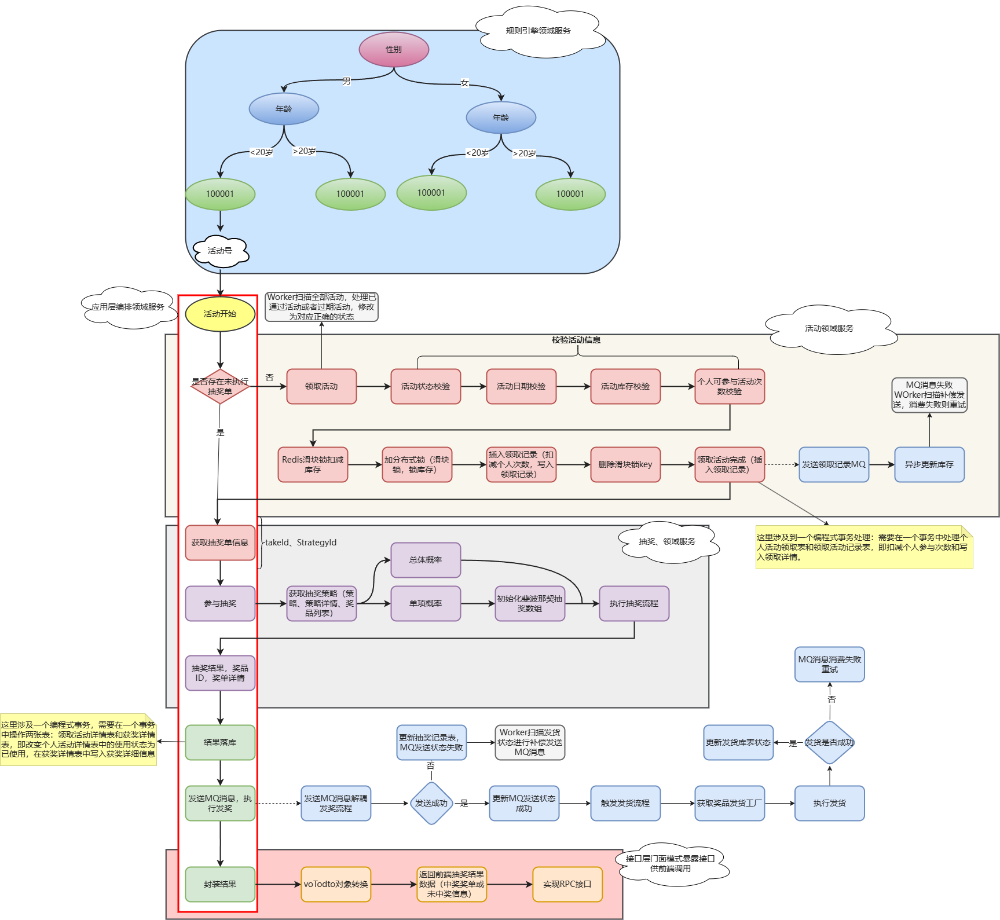

# README

**项目简介：** 抽奖系统是营销平台的重要微服务之一，可以满足 C 端人群的需求，例如拉新、促活、留存等。该系统运用抽象、分治和 DDD 知识，拆解服务边界，凝练领域服务功能。围绕抽奖服务建设领域服务，包括规则引擎、抽奖策略、活动玩法、奖品发放等。这可以满足业务产品快速迭代上线的需求，同时减少研发成本，提高交付效率。

**核心技术：** SpringBoot、Mybatis、Dubbo、MQ、Redis、Mysql、ELK、分库分表、xxl-job、docker。

**项目架构：** DDD领域驱动设计、充血模型、设计模式（策略、组合、模板、工厂、状态）。

**项目流程：**

使用方式：

- 克隆或下载这个仓库到你的本地计算机：`git@github.com:Weiguanghao918/Lottery.git`。
- 首先下载相关依赖，引入分库分表路由组件[db-router-spring-boot-starter](https://github.com/Weiguanghao918/db-router-spring-boot-starter)
- 部署涉及的环境Kafka、nacos、xxl-job-admin、mysql、zookeeper、Redis、portainer、ES等。
- 数据库导入[sql](doc/assets/sql)文件。
- 在[lottery-interfaces](lottery-interfaces)的yml文件中修改自己的相关配置。
- 启动服务([lottery-interfaces](lottery-interfaces))的主启动类。

